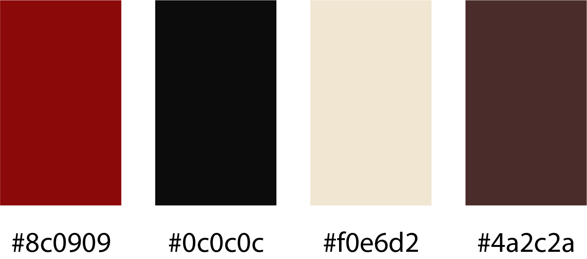
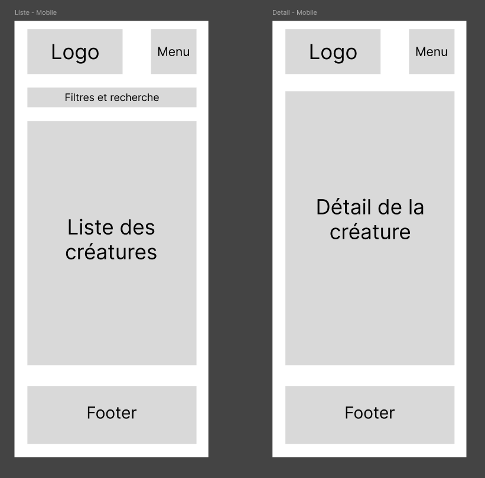

# Présentation du service
Nom de l'application : Les registres du chaos

Logo : à venir

Slogan : La bibliothèque personnalisée pour les maitres du jeu

# Charte graphiques

Couleurs principales

Police d'écriture : à définir

Ambiance visuelle choisie : chaleureux, rougeoyant

# Expression des besoins

## Problème clairement défini : 
Les outils disponibles en ligne sont essentiellement centré sur Dungeons & Dragons, Pathfinder ou des systèmes similaires. Les plus avancés sont principalement en anglais. Il existe des outils en français, mais pas forcément aussi avancés.
Très peu d’outils existent pour les jeux de rôles moins connus, encore moins traduits en français
La préparations de combats / de rencontres n’est pas unique à D&D et/ou Pathfinder. Beaucoup de jeux de rôles ont un système de combat.

## Public cible identifié : 

Les maitres du jeux, mais aussi les joueurs souhaitants s'essayer à ce rôle. Essentiellement le public francophone.

## Fonctionnalité principale : 
Créer son répertoire privé de créatures à utiliser, en sélectionnant parmi une liste de créature présente (comme des favoris)

## Fonctionnalité secondaire : 
Créer des groupes de créatures pour chaque combat (en gros, créé des listes personnelles pour trier les créatures)

# Zoning / Wireframes légers

# Stack technique

Frontend : PHP
Backend : Node.js
Base de données : PostgreSQL